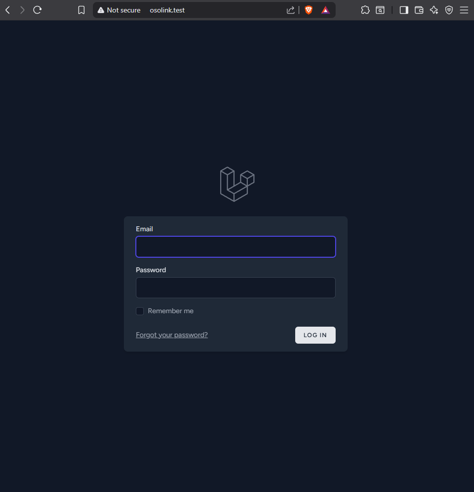
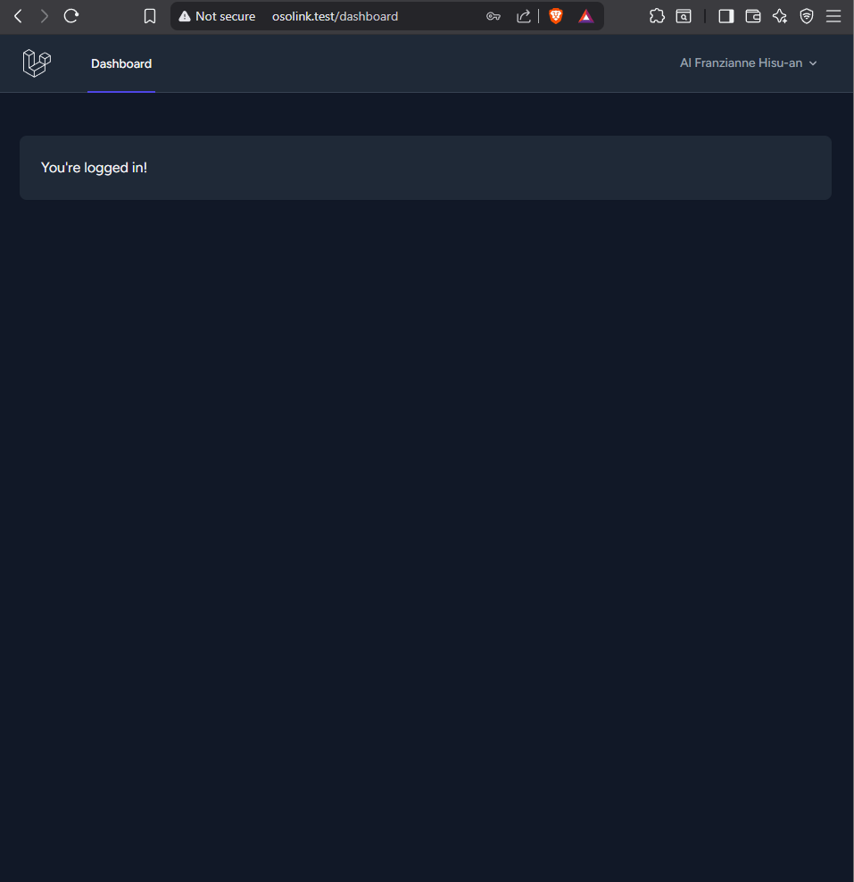
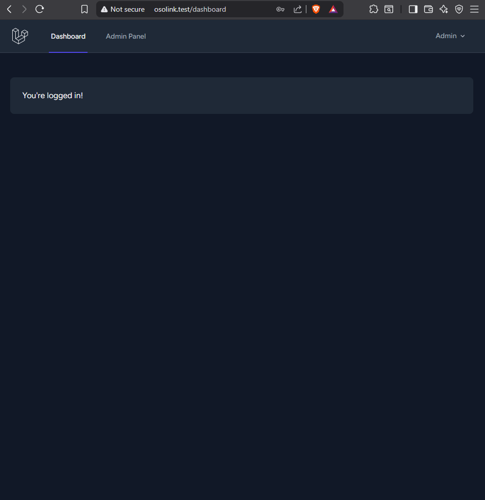
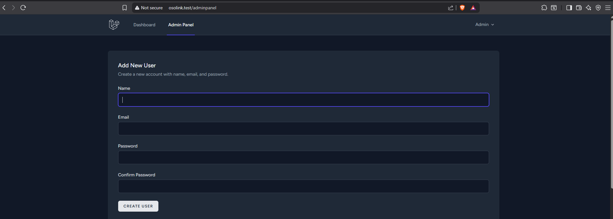
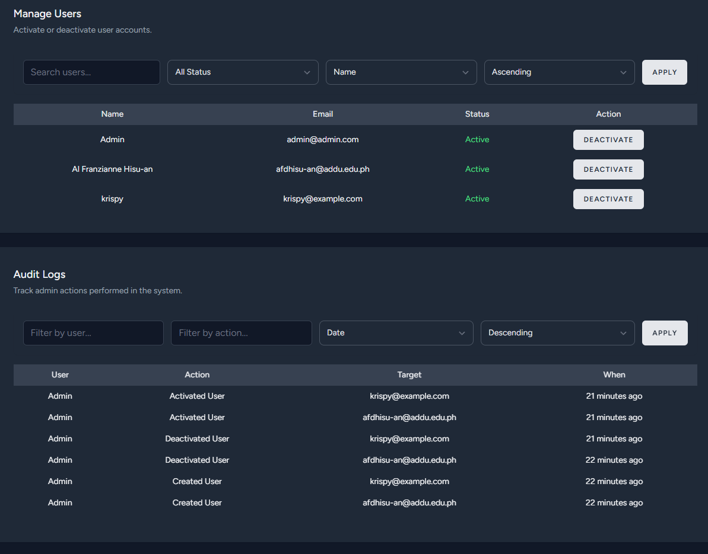

## OSOLink Payroll System (Software Engineering 2 Project)

A Laravel-based web application designed to streamline employee management and automate payroll processing for organizations.
Project is still under development and is still being made.

## Screenshots

### Login


### User Dashboard


### Admin Dashboard


### Admin Panel




---

## How to Setup the Project

Follow these steps to run the OSOLink Payroll System locally:

1. **Clone the Repository**
```bash
git clone https://github.com/AlFranzianne/OSOlink.git
cd OSOlink
```

2. **Install Dependencies**
Make sure PHP, Composer Node.js and npm installed
```bash
composer install
npm install && npm run dev
```

3. **Set Up Environment File**
```bash
 cp .env.example .env
```
Update the .env file with your PostgreSQL credentials, APP_URL, and other settings:
```ini
DB_CONNECTION=pgsql
DB_HOST=127.0.0.1
DB_PORT=5432
DB_DATABASE=yourdatabasename
DB_USERNAME=yourusername
DB_PASSWORD=yourpassword
```

4. **Generate Application Key**
```bash
php artisan key:generate
```

5. **Run Migrations and Seed**
```bash
php artisan migrate
php artisan db:seed
```

6. **Serve the Application (or use Laravel Herd)**
```bash
php artisan serve
Then open your browser and go to:
http://localhost:8000

If you are using the Laravel Herd App:

Open Herd

Go to Sites > Add

Select your project folder (OSOlink)

Herd will assign a local domain (e.g., http://osolink.test)

Open that domain in your browser to access the app
```


## Requirements
- PHP >= 8.4
- Composer
- Laravel 12
- MySQL or PostgreSQL

