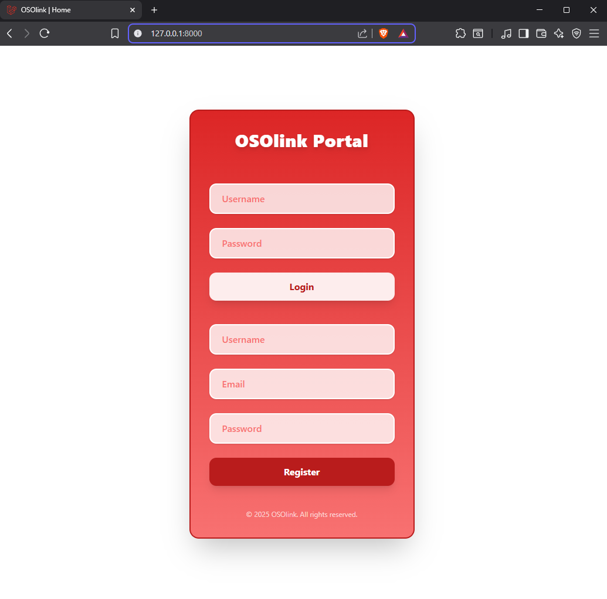
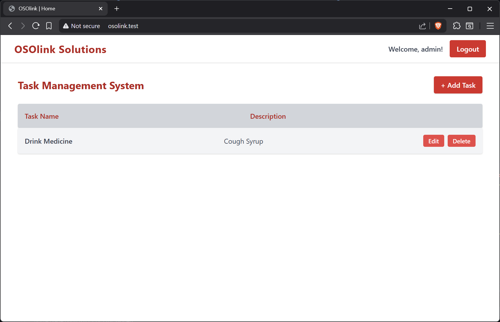
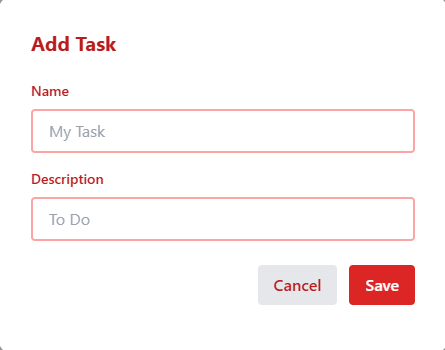
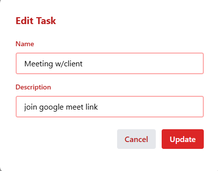

<p align="center"><a href="https://laravel.com" target="_blank"></a></p>

<p align="center">
<a href="https://github.com/laravel/framework/actions"></a>
<a href="https://packagist.org/packages/laravel/framework"></a>
<a href="https://packagist.org/packages/laravel/framework"></a>
<a href="https://packagist.org/packages/laravel/framework"></a>
</p>

# OSOlink Task Management System

## Description

This Task magamement dashboard developed using Laravel and Tailwind CSS. It includes login/registration, using `<ul>` elements, and modals for adding and editing tasks that are alll in a single blade view which is (`login.blade.php`).


## Screenshots

### Login Page


### Dashboard


### Modals




## User Setup Guide

1. Download and install Laravel Herd and install PHP 8.4 and Composer in the app

    For Windows: https://herd.laravel.com/docs/windows/getting-started/installation

    For Mac: https://herd.laravel.com/docs/macos/getting-started/installation

2. Download and install PostgreSQL or MySQL, depending on your preference

    PostgreSQL: https://www.postgresql.org/download/
    
    MySQL: https://www.mysql.com/downloads/

3. Clone the repository `git clone https://github.com/AlFranzianne/OSOlink.git` then run `cd OSOlink` on your terminal to move to the OSOlink directory

4. Install dependencies by running these commands on your terminal, run in Command Prompt if your command is getting blocked by security

```cmd
composer install
npm install
npm run dev
php artisan key:generate
```

5. Set up your environment file by running this command on your terminal `cp .env.example .env` and configure your database info as follows

```dotenv
DB_CONNECTION=pgsql     // (or mysql for MySQL)
DB_HOST=127.0.0.1
DB_PORT=5432            // (or 3306 for MySQL)
DB_DATABASE=your_database_name
DB_USERNAME=your_username
DB_PASSWORD=your_password
```

6. Run the Laravel database migrations `php artisan migrate` to make your Laravel database in PostgreSQL or MySQL

7. While Laravel Herd is running in the background, open `OSOlink.test` in your browser
